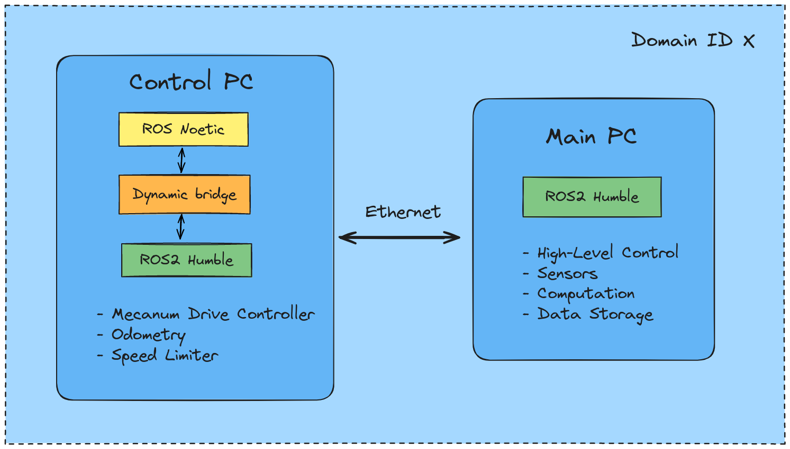
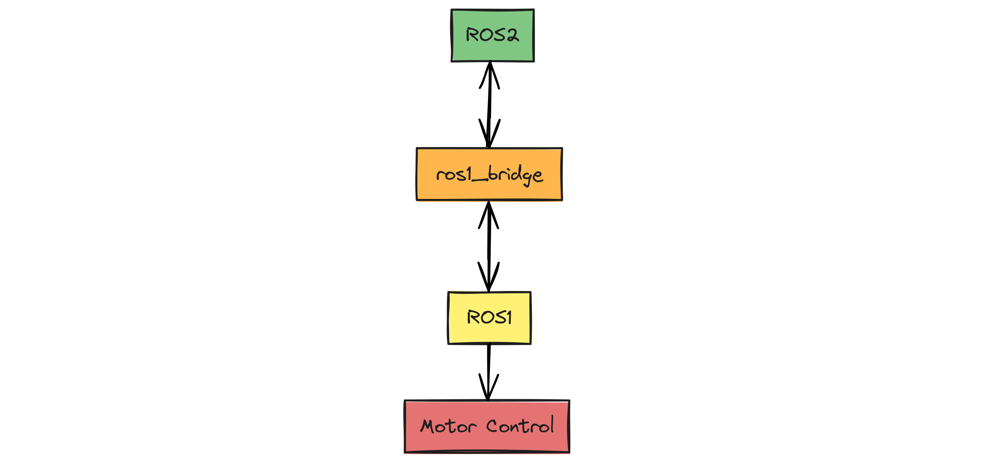

# Installation
This section guides you through installing all the ROS1 and ROS2 packages required to get the robot up and running. The image below illustrates the software architecture of the MoMo robot. Currently, ROS2 drivers for the Maxon motors are unavailable, necessitating the use of two computers. The Control PC (an Intel NUC) handles low-level control and sends velocity commands to the robot base, while the Main PC (Board PC) manages high-level control and computation. In the future, once the drivers become available, we will consolidate all tasks onto the Main PC.



Please follow the installation steps mentioned below in your **Control PC**:


## ROS1 Control
By following this section you will be able to control the robot and send velocity commands in ROS1. Once you are successful in doing this, follow the 
[ROS2 Control (via ROS1 Bridge)](#ros2-control-via-ros1-bridge) section to be able to do the same in ROS2. Since the motor drivers are not yet available, it is necessary to set up the control first in ROS1 before moving to ROS2.

### Install Ubuntu

Install Ubuntu 20.04 in the control PC. It is recommended to have at least 8 GB of RAM for running ROS1 and ROS2 simultaneously using the rosbridge.

### Install ROS

Install ROS Noetic:

[noetic/Installation/Ubuntu - ROS Wiki](http://wiki.ros.org/noetic/Installation/Ubuntu)

Create a catkin_ws for ROS1.

Do not put these lines in .bashrc:

```bash
source /opt/ros/noetic/setup.bash
source ~/catkin_ws/devel/setup.bash
```

Instead manually source it whenever required. You can create an alias if you want in your .bashrc:

```bash
alias sr1='source /opt/ros/noetic/setup.bash && source ~/catkin_ws/devel/setup.bash'
```

We do not want ROS1 to be sourced automatically when we open a terminal every time as it might create conflicts later when we use ros1_bridge with ROS2.

### Clone the Repository

Clone the `noetic` branch of MoMo repository in your `catkin_ws/src`.

```bash
cd ~/catkin_ws/src
git clone -b noetic https://github.com/TUHH-ITL/MoMo.git

```

### Install dependencies

Install `ros_canopen` and its dependencies, install the following ROS packages:

```bash
sudo apt-get install ros-noetic-canopen-* ros-noetic-control* ros-noetic-rqt-controller-manager ros-noetic-joint-state-controller ros-noetic-velocity-controllers ros-noetic-effort-controllers ros-noetic-joint-state-publisher-gui ros-noetic-std-srvs
```

Run the following command to update ROS dependency tree:

```bash
rospack profile
```

### Install required packages

Install the following packages:

```bash
sudo apt-get install ros-noetic-amcl* ros-noetic-move-base* ros-noetic-map-server* ros-noetic-robot-pose-ekf* ros-noetic-twist-mux* ros-noetic-teleop*
```

And also:

```bash
sudo apt install ros-noetic-controller-manager* ros-noetic-twist* ros-noetic-robot-localization*
```

### Build your workspace

Build your catkin_ws:

```bash
cd ~/catkin_ws

catkin_make
```

### Connect the CAN cable

Connect the CAN cable from the robot to the control PC and run the following commands in the terminal:

```bash

sudo ip link set can0 type can bitrate 1000000

sudo ip link set can0 up
```

To check if it is up: 

```bash
ip link show can0
```

### Configure the joystick

Connect the joystick with the control PC to be able to control the robot using the joystick in ROS1. (Check if it is working by following instructions in this [link](http://wiki.ros.org/joy/Tutorials/ConfiguringALinuxJoystick))

### Control the robot

Open two terminals and source ROS1 in both of them and run the following on after the another in following sequence:

```bash
roslaunch momo_description momo_description.launch
```

```bash
roslaunch momo_startup robot_control.launch
```

Now you can move the robot using the joystick, velocity commands are sent to the robot over the `cmd_vel` topic.

## ROS2 Control (via ROS1 Bridge)

### Install ROS2

Install ROS2 Humble from source in the control PC.

[Ubuntu (source) — ROS 2 Documentation: Humble  documentation](https://docs.ros.org/en/humble/Installation/Alternatives/Ubuntu-Development-Setup.html) See the **Note** below.

Clone the [ros1_bridge](https://github.com/ros2/ros1_bridge) package in your `ros2_ws/src`:

```bash
git clone https://github.com/ros2/ros1_bridge.git
```

**Note:** During the build step run this command instead of the command from the official tutorial:
```bash
colcon build --symlink-install --packages-skip ros1_bridge
```

Do not put the following in the .bashrc:

```bash
source ~/ros2_ws/install/setup.bash
```

You can create an alias if you want in your .bashrc (optional):

```bash
alias sr2='source ~/ros2_ws/install/setup.bash'
```

### Uninstall package

You then need to uninstall manually the `controller_manager_msgs` package from ROS noetic, starting first with the share directory:

```bash
cd /opt/ros/noetic/share

sudo rm -r controller_manager_msgs
```

Repeat these steps with include directory:

```bash
cd /opt/ros/noetic/include

sudo rm -r controller_manager_msgs
```

### Build `ros1_bridge`

Build `ros1_bridge` package: (You need to source both ROS1 and ROS2 for this)

```bash
cd ~/ros2_humble

# Source ROS1 first
# Then source ROS2 in the same terminal, and then:

colcon build --symlink-install --packages-select ros1_bridge --cmake-force-configure
```

More information about ros1_bridge can be found [here](https://github.com/ros2/ros1_bridge).

### Reinstall package

Reinstall the `controller_manager_msgs` package:

```bash
sudo apt install ros-noetic-controller-manager-msgs
```

### Source ROS1 and ROS2

Run the ROS1 control as mentioned above and keep it running. Open another terminal and source ROS1 and ROS2 in sequence (in the same terminal), and run the following:

```bash
ros2 run ros1_bridge dynamic_bridge
```

### Publish to topic

In another terminal, source ROS2 only and then publish to the /cmd_vel topic, and the robot should move. For e.g.:

```bash
ros2 topic pub --rate 1 /turtle1/cmd_vel geometry_msgs/msg/Twist "{linear: {x: 0.0, y: 0.0, z: 0.0}, angular: {x: 0.0, y: 0.0, z: 1.8}}"

```




Congratulations! Now you are able to control the robot in ROS1 as well as in ROS2 from the control PC. Now in the next section we add startup scripts to simplify the startup process and setup the SSH connection between the control PC and the Main PC connected via ethernet cable so that we can control the robot from the Main PC in ROS2 Humble without having to enter the password everytime we SSH into the Control PC from the Main PC.


## Setup SSH connection

Setup an SSH connection between the Main PC (board computer) and the Control PC (Intel NUC) so that you don't have to enter password every time you want to SSH into the NUC. This is also a necessary step in case of using the bash scripts while starting the robot.

Generate SSH Key Pair on the **Main PC**:

```bash
ssh-keygen -t rsa -b 4096 -C "your_email@example.com"
```

Press Enter to accept the default file location and optionally set a passphrase.

Copy Public Key to the NUC using: (This should be executed in the Main PC)

```bash
ssh-copy-id username@NUC_IP_Address
```

Replace username with your NUC's username and NUC_IP_Address with the NUC's IP address. (To know IP address: **hostname -I**)

Now you should be able to SSH into the NUC from the board computer without entering the password using:

```bash
ssh username@NUC_IP_address
```

## Clone MoMo Repository in Main PC

Run the following in the **Main PC** to clone the MoMo repository `humble` branch in your `ros2_ws/src`:

```bash
cd ~/ros2_ws/src
git clone -b humble https://github.com/TUHH-ITL/MoMo.git
```

## Install joystick package 

Install the joystick ros package to teleoperate the robot using a joystick from the Main PC in ROS2. On the **Main PC** run the following command:

```bash
sudo apt install ros-humble-teleop-twist-joy

```

## Install catmux

Catmux is a command-line tool used to create and manage Tmux sessions using YAML configuration files.
 
 Run this command in the **Main PC** to install catmux :

```bash
pip3 install --user catmux

```

## Add alias for startup and shutdown

We setup some aliases in the **Main PC** so that we don't have to type long commands everytime working with the robot.

Set the path for yml files: (change if it looks different for you)

```bash
export MOMO_PATH=~/ros2_humble/src/MoMo
```
Set up aliases for starting, stopping and shutting down the robot in the **Main PC**:

```bash
echo "alias wakeupmomo='catmux_create_session $MOMO_PATH/wakeupmomo.yml --session_name wakeupmomo'" >> ~/.bashrc

echo "alias stopmomo='catmux kill-session -t wakeupmomo'" >> ~/.bashrc

echo "alias sleepmomo='catmux_create_session $MOMO_PATH/sleepmomo.yml'" >> ~/.bashrc

```

(**Note**: Read comments in the **wakeupmomo.yml** and **sleepmomo.yml** in the MoMo repository and set variables according to your system)

## Building the documentation locally (for developers only)

The documentation is managed by [Mkdocs](https://www.mkdocs.org/).

Install the following:

```bash
pip install mkdocs
pip install mkdocs-material mkdocs-material-extensions --upgrade
pip install pillow cairosvg --upgrade
```

To view the documentation, locate your terminal where the `mkdocs.yml` file is present and run:

```bash
mkdocs serve
```