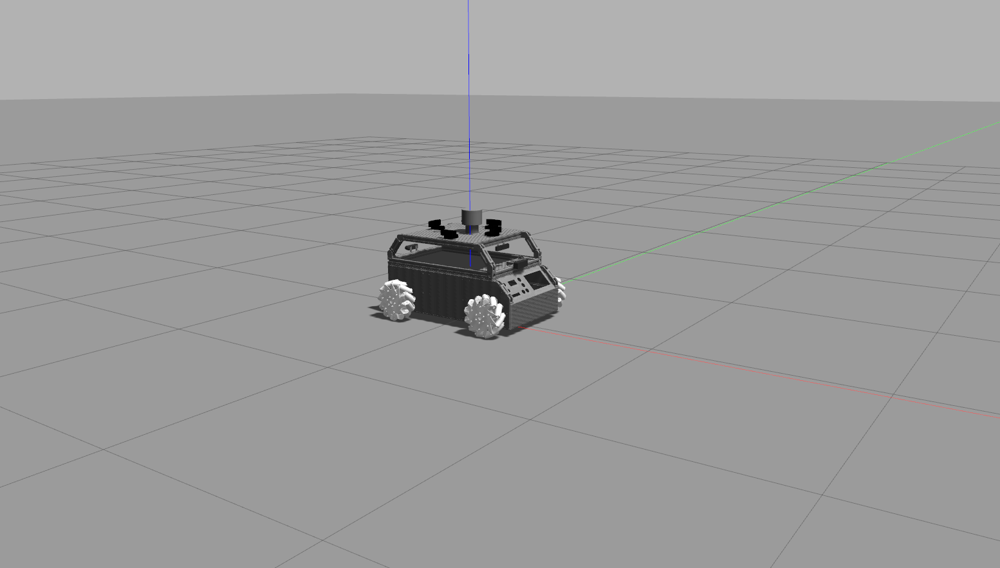

# Simulation

This section provides an overview of the Gazebo simulation environment where you can launch and test MoMo with perception module in different worlds and visualize sensor data.

## Prerequisites

Before you can launch the simulation, ensure the following are installed on your system:

- **ROS 2** (Humble)
- **Gazebo** (version 11)

Make sure your ROS 2 installation is properly sourced.

## Package Overview

The package `momo_description` contains the necessary files to launch MoMo in a Gazebo simulation.

- **URDF files**: Located in the `urdf/` folder, these files describe the robot model using xacro.
- **Launch files**: These files allow you to launch MoMo in either an empty world or a custom world.

## How to Build the Package

First, clone the repository and build the workspace:

```bash
cd ~/ros2_ws/src
git clone --branch humble-perception https://github.com/TUHH-ITL/MoMo
cd ~/ros2_ws
colcon build
```

Source the workspace after building:

```bash
source ~/ros2_ws/install/setup.bash
```

## Launching the Simulation

You can launch MoMo in various environments. Here are the available options:

### 1. Launch MoMo in an Empty World

To launch MoMo in an empty Gazebo world, run the following command:

```bash
ros2 launch momo_description momo_sim.launch.py
```



This will spawn MoMo in an empty world. You can then interact with the robot and visualize the sensor data.

### 2. Launch MoMo in a Custom World

To launch MoMo in the custom museum world:

```bash
ros2 launch momo_description momo_museum.launch.py 
```


This will load MoMo into the custom museum environment.

## Teleoperating the Robot

After launching the simulation, you can teleoperate the robot using the keyboard. Run the following command in a new terminal:

```bash
ros2 run teleop_twist_keyboard teleop_twist_keyboard
```

Use the provided keyboard instructions to control the robot's movement.

## Viewing Sensor Data in RViz

To visualize MoMo’s sensor data (LiDAR, camera, and depth camera) in RViz:


Open a new terminal and launch RViz:
   ```bash
   rviz2
   ```

Add the necessary sensor displays as required.


All sensor topics will be available after the robot is launched in the Gazebo simulation. You can visualize the data in RViz by subscribing to the appropriate topics.

## Further Notes

- **Simulation Requirements**: Ensure Gazebo 11 is installed, as this simulation is designed for Gazebo 11.
- **ROS 2 Compatibility**: This project is built for ROS 2 Humble and has been tested with versions compatible with Gazebo 11.
- **Teleoperation**: Once the robot is launched, you can easily control it via the `teleop_twist_keyboard` ROS 2 node.
- **Sensor Topics**: All sensors (LiDAR, camera, depth camera) publish their respective data to standard ROS 2 topics, which can be visualized in RViz.

## Contributing

Feel free to contribute to the MoMo simulation project by submitting issues or pull requests on the repository.

