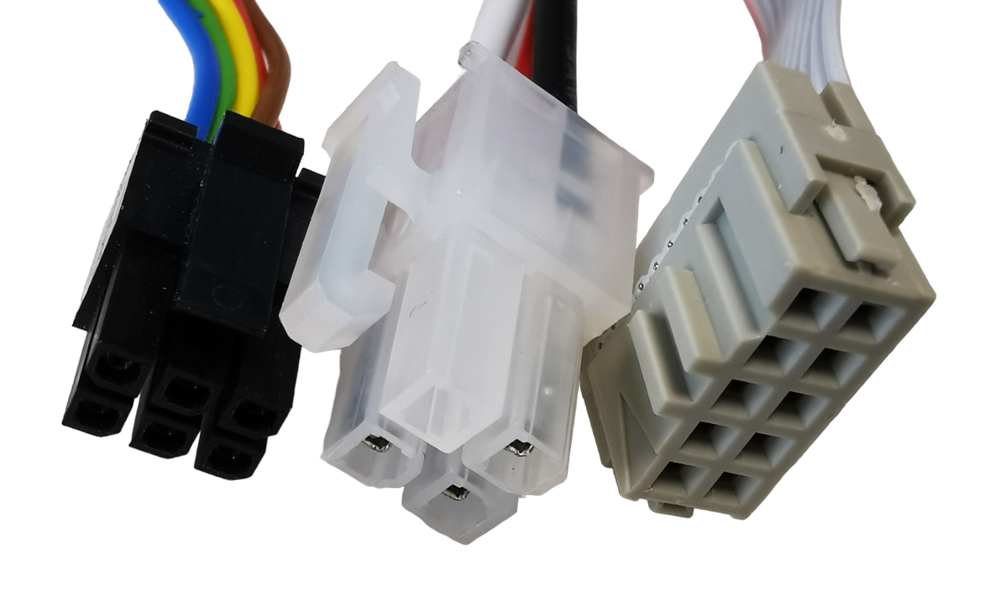
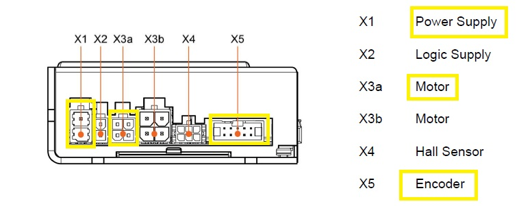
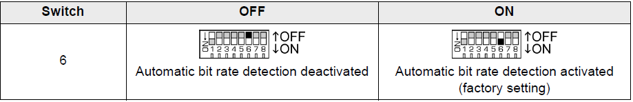
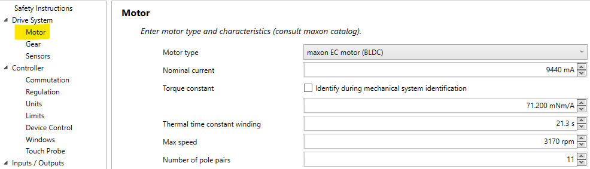
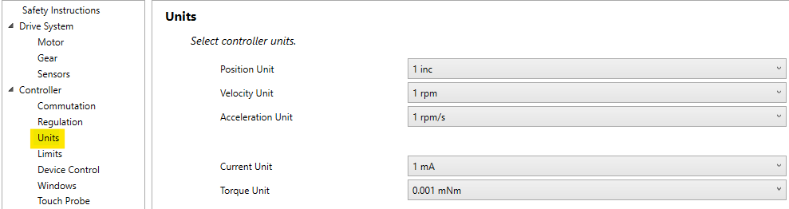
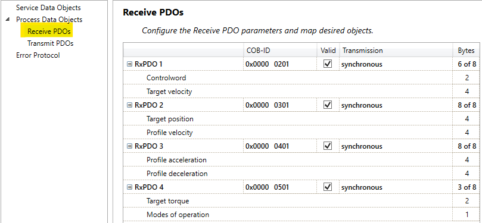

# Build MoMo

This section guides you to build your own MoMo and outlines the manufacturing and assembly process.

The following steps roughly describe the assembly procedure:

1. Cut SMT aluminum construction profiles and assemble the base station.
2. Manufacture custom components
3. Install the motor block (see motor block instructions) in the base station.
4. Connect PC and PC power supply.  
5. Position and wire the electronic components.
6. Electronics: First set or test only the power supply and battery monitor (primary side).
7. Electronics: Upload the arduino code and test all electronic components. 
8. Set the motor driver hardware (Maxon_Set_up instructions).
9. Prepare Epos Studio and parameterize 4 motor drivers (software)  

**Note:** You could also use different manufacturers for aluminum construction profiles, such as ITEM or Bosch, but some connector parts might vary.

## Bill of Materials (BOM)

The following list contains all the components required for the assembly of the robot. The components are divided into different categories. The list is not exhaustive and some components may be missing. The list is intended to provide an overview of the components required for the assembly. The ID column is used to identify the components in the assembly instructions. The vendor column provides the name of the vendor where the component can be purchased. 
The link column provides a link to the vendor's website where the component can be purchased. Of course, the components can also be purchased from other vendors. There is no affiliation with the vendors mentioned in the list. The prices include taxes and are subject to change.

|         |                                                            |              |                   |              |                  |                |                                                                                                                                                                                                                                                                                                                                                                                                                                                                                                                                                                                                                                                                                                                                                                                                                                                                    |
| ------- | ---------------------------------------------------------- | ------------ | ----------------- | ------------ | ---------------- | -------------- | ------------------------------------------------------------------------------------------------------------------------------------------------------------------------------------------------------------------------------------------------------------------------------------------------------------------------------------------------------------------------------------------------------------------------------------------------------------------------------------------------------------------------------------------------------------------------------------------------------------------------------------------------------------------------------------------------------------------------------------------------------------------------------------------------------------------------------------------------------------------ |
| **ID**  | **Item Description**                                       | **Provider** | **Price (**€**)** | **Quantity** | **Total Amount** | **Product ID** | **Link**                                                                                                                                                                                                                                                                                                                                                                                                    
|            | Multiblock 8 PA                                                        | SMT              | 1,28 €                    | 20               | 25,60 €              | S208MBPA           | [Link to vendor](https://www.smt-montagetechnik.de/produkte/361.htm)                                                                                                                                                                                                                                                                                                                                                                                                                                                                                                                                                                                                                                                                             |
|            | Cross Cable Tie Block with Hammer Nut 8-30                             | SMT              | 0,64 €                    | 10               | 6,40 €               | S208KKMH30         | [Link to vendor](https://www.smt-montagetechnik.de/produkte/739n.htm)                                                                                                                                                                                                                                                                                                                                                                                                                                                                                                                                                                                                                                                                            |
|            | Cable Tie Block 8                                                      | SMT              | 0,41 €                    | 20               | 8,20 €               | S208KBB            | [Link to vendor](https://www.smt-montagetechnik.de/produkte/3290.htm)                                                                                                                                                                                                                                                                                                                                                                                                                                                                                                                                                                                                                                                                            |
|            | Cover and Edging Profile 8 Black 1000mm                                | SMT              | 0,81 €                    | 5                | 4,05 €               | S208AEPSCHK        | [Link to vendor](https://www.smt-montagetechnik.de/produkte/1422n.htm)                                                                                                                                                                                                                                                                                                                                                                                                                                                                                                                                                                                                                                                                           |
|            | Angle Bracket Set 8 30x30 Aluminum                                     | SMT              | 1,22 €                    | 10               | 12,20 €              | S208WS30A          | [Link to vendor](https://www.smt-montagetechnik.de/produkte/341n.htm)                                                                                                                                                                                                                                                                                                                                                                                                                                                                                                                                                                                                                                                                            |
|            | Cube Connector Set 8 30x30 3D                                          | SMT              | 3,08 €                    | 10               | 30,80 €              | S208WV30303DS      | [Link to vendor](https://www.smt-montagetechnik.de/produkte/1410n.htm)                                                                                                                                                                                                                                                                                                                                                                                                                                                                                                                                                                                                                                                                           |
|            | T-Slot Nut 8, with Bridge, M5                                          | SMT              | 0,23 €                    | 30               | 6,90 €               | S208NSMS5          | [Link to vendor](https://www.smt-montagetechnik.de/produkte/43.htm)                                                                                                                                                                                                                                                                                                                                                                                                                                                                                                                                                                                                                                                                              |
|            | T-Slot Nut 8, with Bridge, M6                                          | SMT              | 0,23 €                    | 30               | 6,90 €               | S208NSMS6          | [Link to vendor](https://www.smt-montagetechnik.de/produkte/44.htm)                                                                                                                                                                                                                                                                                                                                                                                                                                                                                                                                                                                                                                                                              |
|            | T-Slot Nut 8, with Bridge, M8                                          | SMT              | 0,23 €                    | 30               | 6,90 €               | S208NSMS8          | [Link to vendor](https://www.smt-montagetechnik.de/produkte/45.htm)                                                                                                                                                                                                                                                                                                                                                                                                                                                                                                                                                                                                                                                                              |
|            | Joint 30x30                                                            | SMT              | 7,13 €                    | 6                | 42,78 €              | S208G30            | [Link to vendor](https://www.smt-montagetechnik.de/produkte/1210n.htm)                                                                                                                                                                                                                                                                                                                                                                                                                                                                                                                                                                                                                                                                           |
|            | Profile 8 30x30 Black                                                  | SMT              | 21,35 €                   | 6                | 128,10 €             | S1083030SCH        | [Link to vendor](https://www.smt-montagetechnik.de/produkte/1273n.htm)                                                                                                                                                                                                                                                                                                                                                                                                                                                                                                                                                                                                                                                                           |
|            | T-Slot Nut 8, with Bridge, M3                                          | SMT              | 0,23 €                    | 30               | 6,90 €               | S208NSMS3          | [Link to vendor](https://www.smt-montagetechnik.de/produkte/3420.htm)                                                                                                                                                                                                                                                                                                                                                                                                                                                                                                                                                                                                                                                                            |
|            | T-Slot Nut 8, with Bridge, M4                                          | SMT              | 0,23 €                    | 30               | 6,90 €               | S208NSMS4          | [Link to vendor](https://www.smt-montagetechnik.de/produkte/42.htm)                                                                                                                                                                                                                                                                                                                                                                                                                                                                                                                                                                                                                                                                              |
|            | T-Connector Plate 30                                                   | SMT              | 1,14 €                    | 20               | 22,80 €              | S208TVP30          | [Link to vendor](https://www.smt-montagetechnik.de/produkte/1739n.htm)                                                                                                                                                                                                                                                                                                                                                                                                                                                                                                                                                                                                                                                                           |
|            | Cover Profile 8 32x4                                                   | SMT              | 5,38 €                    | 4                | 21,52 €              | S208AP324          | [Link to vendor](https://www.smt-montagetechnik.de/produkte/504n.htm)                                                                                                                                                                                                                                                                                                                                                                                                                                                                                                                                                                                                                                                                            |
|            | Mecanum wheel set                                                   | Robotshop        | 554,74 €                  | 1                | 554,74 €             | RB-Nex-74          | [Link to vendor](https://eu.robotshop.com/de/products/203mm-stahl-mecanum-radsatz-2x-links-2x-rechts?_gl=1%2Amrjgbs%2A_up%2AMQ..&gclid=CjwKCAjw6IiiBhAOEiwALNqncVad6xE44pMZ95tl3s81Hvl753T9tH9SZwepu-FLE1pLpo1TOeRvgBoCPr0QAvD_BwE)                                                                                                                                                                                                                                                                                                                                                                                                                                                                                            |
| ID1-ID4    | Motor Controller                                                       | Maxon Motor      | 916,30 €                  | 4                | 3.665,20 €           | 594385             | [Link to vendor](https://www.maxongroup.de/maxon/view/product/control/Positionierung/EPOS-4/594385?etcc_cu=onsite&etcc_med=Header%20Suche&etcc_cmp=mit%20Ergebnis&etcc_ctv=Layer&query=594385)                                                                                                                                                                                                                                                                                                                                                                                                                                                                                                                                 |
|            | Encoder                                                                | Maxon Motor      | 247,19 €                  | 4                | 988,76 €             | 607515             | [Link to vendor](https://www.maxongroup.de/maxon/view/product/sensor/encoder/Induktive-Encoder/Encoder-MILE-512-6400-/607515)                                                                                                                                                                                                                                                                                                                                                                                                                                                                                                                                                                                                  |
|            | Motors                                                                 | Maxon Motor      | 294,16 €                  | 4                | 1.176,64 €           | 607946             | [Link to vendor](https://www.maxongroup.de/maxon/view/product/motor/ecmotor/ecflat/ecflat90/607946)                                                                                                                                                                                                                                                                                                                                                                                                                                                                                                                                                                                                                            |
|            | Planetary Gearbox                                                      | Maxon Motor      | 507,04 €                  | 4                | 2.028,16 €           | 223086             | [Link to vendor](https://www.maxongroup.de/maxon/view/product/gear/planetary/gp52/223086)                                                                                                                                                                                                                                                                                                                                                                                                                                                                                                                                                                                                                                      |
|            | Power Cable                                                            | Maxon Motor      | 17,90 €                   | 4                | 71,60 €              | 275829             | [Link to vendor](https://www.maxongroup.de/maxon/view/product/accessory/1-mmckabel/275829)                                                                                                                                                                                                                                                                                                                                                                                                                                                                                                                                                                                                                                     |
|            | Intelligent connector system from Harting (1 male, 1 female connector) | Harting          | 512,00 €                  | 1                | 512,00 €             |                    | [Click Here](#instruction-for-component-configuration-module-electric-connector-mec)                                                                                                                                                                                                                                                                                                                                                                                                                                                                                                                                                                                                                                           |
| BAT1       | Lithium-ion battery 24V 60Ah 1440Wh 60A                                | Akkushop-24      | 569,00 €                  | 1                | 569,00 €             | 2460               | [Link to vendor](https://www.akkushop-24.de/Lithium-Ionen-Akku-24V-60Ah-1440Wh-Akkupack-incl-60A-BMS-Ladegeraet-fuer-Scooter-E-Bike-Pedelec-Camping-Boot)                                                                                                                                                                                                                                                                                                                                                                                                                                                                                                                                                                      |
| X5         | Clamp ptfix 6/...X1.5 blue                                             | reichelt         | 3,35 €                    | 1                | 3,35 €               | PHOE 3273332       | [Link to vendor](https://www.reichelt.de/verteilerblock-ptfix-6-6x2-5-bu-ptfix-6x2-5-bu-p207663.html?PROVID=2788&gclid=Cj0KCQjwsIejBhDOARIsANYqkD0AlSDGtOVlEb4zSLWkYki5iJIvxwnJ8L0vs2A6c9AuUX0GYdNRta0aAuK9EALw_wcB)                                                                                                                                                                                                                                                                                                                                                                                                                                                                                                           |
| X4         | Clamp ptfix 6/...X1.5 red                                              | reichelt         | 3,25 €                    | 1                | 3,25 €               | PHOE 3273334       | [Link to vendor](https://www.reichelt.de/verteilerblock-ptfix-6-6x2-5-rd-ptfix-6x2-5-rd-p207665.html?&trstct=vrt_pdn&nbc=1)                                                                                                                                                                                                                                                                                                                                                                                                                                                                                                                                                                                                    |
|            | Flange PTFIX 1.5                                                       | reichelt         | 0,36 €                    | 4                | 1,44 €               | 104524             | [Link to vendor](https://www.automation24.de/flansch-phoenix-1049503-ptfix-1-5-f?refID=adwords_DSA_DE&gad_source=1&gclid=CjwKCAjw1920BhA3EiwAJT3lSbhTfnlPvWZmIEsm_zT0XBuARnjS8t4hMd5zS1ZxM6u5AvufEsRNbBoCM10QAvD_BwE)                                                                                                                                                                                                                                                                                                                                                                                                                                                                                                          |
|            | Flange PTFIX 2.5                                                       | reichelt         | 0,36 €                    | 4                | 1,44 €               | 104525             | [Link to vendor](https://www.automation24.de/flansch-phoenix-3274060-ptfix-f?previewPriceListId=8&gad_source=1&gclid=CjwKCAjw1920BhA3EiwAJT3lSRSPUUDB7KAr3K7-EG7cUzGGo5I3sRBOcMQcWw4_QdGztZ46LyKYIBoCLIoQAvD_BwE)                                                                                                                                                                                                                                                                                                                                                                                                                                                                                                              |
| X1         | Distribution block PTFIX, 12x2.5 Gray                                  | reichelt         | 6,10 €                    | 1                | 6,10 €               | PHOE 3273352       | [Link to vendor](https://www.reichelt.de/verteilerblock-ptfix-12x2-5-grau-ptfix-12x2-5-gy-p262113.html?&trstct=pos_4&nbc=1)                                                                                                                                                                                                                                                                                                                                                                                                                                                                                                                                                                                                    |
| X2         | Distribution block PTFIX, 12x2.5 Red                                   | reichelt         | 6,20 €                    | 1                | 6,20 €               | PHOE 3273356       | [Link to vendor](https://www.reichelt.de/verteilerblock-ptfix-12x2-5-rot-ptfix-12x2-5-rd-p262115.html?&trstct=pos_11&nbc=1)                                                                                                                                                                                                                                                                                                                                                                                                                                                                                                                                                                                                    |
| X3         | Distribution block PTFIX, 12x2.5 Blue                                  | reichelt         | 6,10 €                    | 1                | 6,10 €               | PHOE 3273354       | [Link to vendor](https://www.reichelt.de/verteilerblock-ptfix-12x2-5-blau-ptfix-12x2-5-bu-p262114.html?&trstct=pos_7&nbc=1)                                                                                                                                                                                                                                                                                                                                                                                                                                                                                                                                                                                                    |
| S1         | Stainless steel pressure switch Ø19mm                                  | Metzler       | 14,99 €                   | 2                | 29,98 €              | P19-RF-RGB         | [Link to vendor](https://metzler-electronics.com/metzler-druckschalter-19mm-led-ringbeleuchtung-rgb-ip67-ik10-edelstahl-flach-loetkontakte)                                                                                                                                                                                                                                                                                                                                                                                                                                                                                                                                                                                    |
| U1         | Battery monitor 50A / 70A BW801e                                       | LEAB             | 137,00 €                  | 1                | 137,00 €             | 1305041043         | [Link to vendor](https://signaltech.de/leab-batteriewaechter-50a-70a-unterspannungsschutz.html)                                                                                                                                                                                                                                                                                                                                                                                                                                                                                                                                                                                                                                |
| U3         | Can Master Module Kvaser Leaf Light HS v2                              | distrelec        | 285,00 €                  | 1                | 285,00 €             | 110-70-530         | [Link to vendor](https://www.distrelec.de/de/can-bus-kanaele-usb-kvaser-00685/p/11070530?srsltid=AR57-fDjo9uxdqC7g0Ehi9veDB46bEmmg4VAraZevWJD1vyGPAyUt7Bq6Ww)                                                                                                                                                                                                                                                                                                                                                                                                                                                                                                                                                                  |
| S2         | Emergency stop button                                                  | conrad           | 13,44 €                   | 1                | 13,44 €              | 2304760 - 62       | [Link to vendor](https://www.conrad.de/de/p/tru-components-not-aus-schalter-3-a-1-oeffner-ip65-1-st-2304760.html?hk=SEM&WT.mc_id=google_pla&gclid=Cj0KCQjwu-KiBhCsARIsAPztUF3kGh-cgnpeN6dj0_xiBnBx47u3IvGZOP3-sYAk4Kd2U-SBO9w8z6saAqjxEALw_wcB)                                                                                                                                                                                                                                                                                                                                                                                                                                                                                |
| K1         | Solid state relay TC-GSR-1-100DD 100 A                                 | conrad           | 26,04 €                   | 2                | 52,08 €              | 2527195 - 62       | [Link to vendor](https://www.conrad.de/de/p/tru-components-halbleiterrelais-tc-gsr-1-100dd-100-a-schaltspannung-max-220-v-dc-gleichstromschaltung-1-st-2527195.html?hk=SEM&WT.mc_id=google_pla&gclid=Cj0KCQjwpPKiBhDvARIsACn-gzCxjVu7Zf-64OcgkGWAOq9xAMo0d3udpGCEiM2V7yjAwmEdRKTZbtQaAtLsEALw_wcB)                                                                                                                                                                                                                                                                                                                                                                                                                       |
| F1         | 4x circuit distributor FHA504 flat fuse                                | conrad           | 25,20 €                   | 1                | 25,20 €              | 1628982 - 62       | [Link to vendor](https://www.conrad.de/de/p/secoruet-fha504-led-stromkreisverteiler-flachsicherung-standard-pole-4-30-a-1-st-1628982.html?gclid=Cj0KCQjwl7qSBhD-ARIsACvV1X1Dn3QoKmx6G6jWQlv8yP37dwaOnF2A3XIFKkvL5jfbOKgSLhv7aioaAry5EALw_wcB&hk=SEM&WT.srch=1&WT.mc_id=google_pla&s_kwcid=AL%21222%213%21544530452548%21%21%21u%21%21&ef_id=Cj0KCQjwl7qSBhD-ARIsACvV1X1Dn3QoKmx6G6jWQlv8yP37dwaOnF2A3XIFKkvL5jfbOKgSLhv7aioaAry5EALw_wcB%3AG%3As)                                                                                                                                                                                                                                                                          |
| F2         | 6x FHA506 flat fuse circuit distributor                                | conrad           | 24,36 €                   | 1                | 24,36 €              | 1628986 - 62       | [Link to vendor](https://www.conrad.de/de/p/secoruet-fha506-led-stromkreisverteiler-flachsicherung-standard-pole-6-30-a-1-st-1628986.html?gclid=Cj0KCQjwl7qSBhD-ARIsACvV1X1Dn3QoKmx6G6jWQlv8yP37dwaOnF2A3XIFKkvL5jfbOKgSLhv7aioaAry5EALw_wcB&hk=SEM&WT.srch=1&WT.mc_id=google_pla&s_kwcid=AL%21222%213%21544530452548%21%21%21u%21%21&ef_id=Cj0KCQjwl7qSBhD-ARIsACvV1X1Dn3QoKmx6G6jWQlv8yP37dwaOnF2A3XIFKkvL5jfbOKgSLhv7aioaAry5EALw_wcB%3AG%3As)                                                                                                                                                                                                                                                                      |
| F3         | Flat fuse 50A                                                          | conrad           | 3,44 €                    | 1                | 3,44 €               | 839760 - 62        | [Link to vendor](https://www.conrad.de/de/p/mta-automotive-mta-340029-standard-flachsicherung-15-a-blau-1-st-839760.html)                                                                                                                                                                                                                                                                                                                                                                                                                                                                                                                                                                                                      |
| T1         | 30V to 12V voltage converter                                           | Amazon           | 24,99 €                   | 1                | 24,99 €              |                    | [Link to vendor](https://www.amazon.de/Bauer-Electronics-12V-Spannungswandler-240W/dp/B09CYX2B4M/ref=sr_1_12?__mk_de_DE=%C3%85M%C3%85%C5%BD%C3%95%C3%91&crid=22SHV6XVGR0CQ&keywords=24V%2B20A%2Bnetzteil%2Bmit%2Bdisplay&qid=1649322873&sprefix=24v%2B20a%2Bnetzteil%2Bmit%2Bdisplay%2Caps%2C75&sr=8-12&th=1)                                                                                                                                                                                                                                                                                                                                                                                                              |
|            | 7-inch display                                                         |                  |                           |                  |                      |                    |                                                                                                                                                                                                                                                                                                                                                                                                                                                                                                                                                                                                                                                                                                                                |
| K2         | Schneider Electric ZBRRA receiver for wireless push-button             | voelkner         | 165,04 €                  | 1                | 165,04 €             | W14844             | [Link to vendor](https://www.voelkner.de/products/431170/Schneider-Electric-ZBRRA-Empfaenger-fuer-Funktaster-1St..html?ref=11&offer=599f36e99ec35d3e5eb8df2b07d554ad&utm_source=billiger&utm_medium=CPC&utm_campaign=W14844&utm_content=intern)                                                                                                                                                                                                                                                                                                                                                                                                                                                                                |
| S3         | Schneider Electric XB4BA21 Harmony XB4BA21 Push-button Actuator flat   | voelkner         | 11,18 €                   | 1                | 11,18 €              | W11012             | [Link to vendor](https://www.voelkner.de/products/431571/Schneider-Electric-XB4BA21-Harmony-XB4BA21-Drucktaster-Betaetiger-flach-1-Taste-Schwarz-Druckentriegelung-1St..html?offer=0afd0b646b01ef998e6e4e6c4cfa1b74)                                                                                                                                                                                                                                                                                                                                                                                                                                                                                                           |
| B1         | Battery Voltage Meter                                                  | Amazon           | 12,50 €                   | 1                | 12,50 €              |                    | [Link to vendor](https://www.amazon.de/Multifunktionaler-Batteriekapazit%C3%A4tsmonitor-Programmierbarer-Batteriestand-Spannungs-Temperaturmesser/dp/B0793PJSJM/ref=sr_1_28?__mk_de_DE=%C3%85M%C3%85%C5%BD%C3%95%C3%91&crid=PFB5K2BJL3B1&dib=eyJ2IjoiMSJ9.GKd5oL9vf9OnpKXrjJfsp2uimvOiAWSqrcekDWXYDd1mZnuoTmh7QMa0cxQYfxSCsv0rETPPwoKG7mDAXxTZQZRuif7KN8SZA3HSP2HFaVrc4jOXDBiJxJvyQYWJ5q24PKi2NFm1aksfaO-lYX0QvNUQUFCnE7bzGtL0BhjwwADeAW7ajj3bxeueM1wccyIAZlThfzMfuhXcaIK7ovXwOwKGlezOBdAFoVx_jSNFoaEv8BUMhu33hyfVIkQTv8oPG47AjvUs43-eQAbThhN35aMVJ6wBls5EGl-I8u1Myo8.jmdAdQQU5td-IoTcquonuj0R_hHhfAvHjdHe_0yBBQ8&dib_tag=se&keywords=Voltage%2BDisplay&qid=1715934908&sprefix=voltage%2Bdisplay%2Caps%2C122&sr=8-28&th=1) |
| X6-X10     | Molex crimp housing - micro-fit - 2x2-pin - plug                       | reichelt         | 0,60 €                    | 4                | 2,40 €               | MOLEX 430200401    | [Link to vendor](https://www.reichelt.de/molex-crimpgehaeuse-micro-fit-2x2-polig-stecker-molex-430200401-p236633.html?&nbc=1&trstct=lsbght_sldr::185681)                                                                                                                                                                                                                                                                                                                                                                                                                                                                                                                                                                       |
| X16        | USB3 Socket                                                            | Reichelt         | 8,74 €                    | 1                | 8,74 €               |                    | [Link to vendor](https://www.reichelt.de/usb-adapter-ft-1-x-usb-3-0-a-buchse-1-x-usb-3-0-a-buchse-cliff-cp30205nx-p227640.html?PROVID=2788&gad_source=1&gclid=CjwKCAjw34qzBhBmEiwAOUQcF63Lqd-gt399wzk9gZ8FwcJBCKz1O7iTXOb5u37ZQZs-eYYXnLkPGRoCP4oQAvD_BwE)                                                                                                                                                                                                                                           |
| X15        | USB2 Socket                                                            | Reichelt         | 6,39 €                    | 1                | 6,39 €               |                    | [Link to vendor](https://www.reichelt.de/d-typ-modul-usb-2-0-typ-a-buchse-buchse-delock-86784-p292552.html?PROVID=2788&gad_source=1&gclid=CjwKCAjw34qzBhBmEiwAOUQcF15GVtKm17Wz7MQBUeV-VmWX88guievV709286pG9TRYVMyZAtZXaRoC-GwQAvD_BwE)                                                                                                                                                                                                                                                                                   |
| X20        | HDMI Socket                                                            | conrad           | 17,99 €                   | 1                | 17,99 €              |                    | [Link to vendor](https://www.conrad.de/de/p/neutrik-nahdmi-w-b-hdmi-steckverbinder-flanschbuchse-kontakte-gerade-polzahl-19-schwarz-1-st-733868.html?hk=SEM&WT.mc_id=google_pla&gad_source=1&gclid=CjwKCAjw34qzBhBmEiwAOUQcFxGX8HxvL9Tey1Q6g0Zh4fJPx9Ur3-h-CpIkSYD86mkNw2s0YWYpRRoCnaYQAvD_BwE)                                                                                                                                                                 |
| X19        | Ethernet Socket                                                        | conrad           | 6,99 €                    | 1                | 6,99 €               |                    | [Link to vendor](https://www.conrad.de/de/p/tru-components-tc-9554644-rj45-durchgangs-einbaubuchse-d-form-cat-6a-buchse-gerade-polzahl-8p8c-schwarz-1-st-2388661.html?hk=SEM&WT.mc_id=google_pla&gad_source=1&gclid=CjwKCAjw34qzBhBmEiwAOUQcF9NkPhTUIKAwlcT9-Lofgy_XZOYgYrt-pNHCgeCd5ML8_nQv4KssJBoC0SsQAvD_BwE)                                                                                                                               |
| PC1        | Motherboard                                                            | bicker           | 380,80 €                  | 1                | 380,80 €             |                    | [Link to vendor](https://www.bicker.de/q670ei-im-a_mini-itx_asus_industrie_serie_intel-q670e_alder_lake_lga1700_socket_12_gen_max_65w_tdp_mainboard)                                                                                                                                                                                                                                                                                                                                                                                                                                                       |
| PC1        | CPU Fan                                                                | Voelkner         | 52,65 €                   | 1                | 52,65 €              |                    | [Link to vendor](https://www.voelkner.de/products/5227857/Noctua-NH-L9i-17xx-CPU-Kuehler-mit-Luefter.html?ref=43&offer=0&utm_source=google&utm_medium=organic&utm_campaign=fpla&gclid=Cj0KCQiA6fafBhC1ARIsAIJjL8kEhuzKGjw_Yh3bl250rXOk176e_mMEh1uvcilgkAF_mC4i6vPJTewaAuuzEALw_wcB)                                                                                                                                                                                                                                                                                                                                                                                                                                                              |
| PC1        | WiFi                                                                   | reichelt         | 16,76 €                   | 1                | 16,76 €              |                    | [Link to vendor](https://www.reichelt.de/wlan-adapter-m-2-2230-card-wi-fi-6-intel-ax200-p267572.html?PROVID=2788&gclid=Cj0KCQiA6fafBhC1ARIsAIJjL8lFQp6k8WGkuYKUDCyHWEdV0z0E7X8LVEovhgBkl9gPMeFqN_pVlY8aAosBEALw_wcB)                                                                                                                                                                                                                                                                                                                       |
| PC1        | 64 GB RAM                                                              | cyberport        | 268,00 €                  | 1                | 268,00 €             |                    | [Link to vendor](https://www.cyberport.de/?DEEP=2622-01Z&APID=639&gclid=Cj0KCQiA6fafBhC1ARIsAIJjL8lmnEps1_0lHVrJWzF_y68RZOaFnO-iqENbBjIQRGsuhJCDqT48bmcaAjz7EALw_wcB)                                                                                                                                                                                                                                                                                                                                                                                                                     |
| PC1        | i9 12900T Processor                                                    | alternate        | 625,00 €                  | 1                | 625,00 €             |                    | [Link to vendor](https://www.alternate.de/html/product/1778364?partner=goadwoPLA&partner=goadwomPer&campaign=300310992&adgroup=23549733792//&campaignCode=STREICHP_OFFPAGE&gclid=Cj0KCQiA6fafBhC1ARIsAIJjL8kFSwSmK6kLiqukF8opL3nCxwk1UwxrdirNE3TG3Ug8IEuNPZ1iUA0aAnYREALw_wcB)                                                                                                                                                                                                   |
| T2         | M3-ATX-HV 6-34V DC/DC (95 W)                                           | minipc           | 69,95 €                   | 1                | 69,95 €              | 1217               | [Link to vendor](https://www.minipc.de/de/catalog/il/1217?gclid=CjwKCAjw2K6lBhBXEiwA5RjtCbwAVppkQG4ITdDYe3kyV_7s95VNdMrUlZnjSDIfqCKNVtSpzDZbIRoCahQQAvD_BwE)                                                                                                                                                                                                                                                                                                                                                                                                                                       |                                                                                                                                                                                                                                                                                                                                                                                                                                                                                                                                                                                                                                                                                                                                                                                                                                                                                                                                                                                                         |                                                                                                                                                                                                                                                                                                                                                                                                                                                                                                                                                                                                                                                                                                                                                                                                                                                                  

***Note:** Depending on your floor it might be good to choose rubber mecanum wheels instead of nylon mecanum wheels in order to ensure better traction. [Rubber mecanum wheels](https://eu.robotshop.com/de/products/203mm-stahl-mecanum-rad-mit-gummirollen-2xlinks-2xrechts) are recommended for smooth floors (e.g. smooth concrete) and nylon wheels are recommended for floors that have more rough texture.*

## Manufacture custom components

Before the assembly can begin, some custom parts need to be manufactured using a lathe and a milling machine.
For the manufacturing we provide the 2D drawings of the individual components. The PDFs contain important data for the production of each part.

- [Gear cover](assets/Abdeckung_Lager_Motor.pdf)
- [Spacer bearing wheel](assets/Abstandshülse_Lager_Rad.pdf)  
- [Flange gear motor](assets/Flansch_Getriebemotor.pdf)  
- [Flange cover](assets/Abdeckkappe_Flansch.pdf)  
- [Wheel mounting disc](assets/Rad_Befestigungsscheibe.pdf)  
- [Wheel shaft](assets/Rad-Welle-1.pdf)  
- [Motor block assembly](assets/Motorblock_Gesamt.pdf)  

## Instructions for Assembling the Motor Blocks

In the following the instructions for assembling the motor blocks are explained step-by-step. The entire process is visualized below:

### Gather Components

For the assembly of **one** motor block you require the following parts:

- 2 ball bearings: 6003-2Z, Deep groove ball bearing, single row, Inner diameter 17mm / Outer diameter 35mm, Width 10mm
- 1 retaining ring (DIN 471 17x1 VE200)
- 1 wheel Shaft
- 4 countersunk screws (DIN7991 M5 x 12mm)
- 1 motor with gearbox (motor and gearbox are delivered pre-assembled)
- 1 gearbox cover
- 1 flange
- 4 cylinder screws (DIN912 M5 x 70 mm)
- 4 countersunk screws (M4 x 8mm)
- 1 spacer bearing wheel
- 4 slot nuts (M8)
- 4 cylinder screws (M8)
- 1 flange cover
- 4 countersunk screws (M4 x 8mm)
- 1 mecanum wheel (should be delivered pre-assembled)
- 1 wheel mounting disk
- 1 fine screw (DIN 912 M8 x 16)

### Mount and Secure Ball Bearing on Shaft

A ball bearing with a retaining ring for a 17mm shaft must be installed as shown in the picture below.

### Connection of the Gearbox cover to the Motor

On the motor, the gearbox cover is attached and secured with 4 countersunk screws (DIN7991 M5 x 12mm). Please refer to the image below!

### Connecting the motor with the shaft and the flange

Then, connect the pre-assembled shaft (Step 1) 1 to the flange and secure it with 4 cylinder screws (DIN912 M5 x 70 mm). Please refer to the image below!

### Attachment of the flange cover

The next step is to attach the second ball bearing with the flange cover and secure it with 4 countersunk screws (M4 x 8mm). The second ball bearing should be attached carefully as it has little slack. The flange cover must be completely closed, there should be no gap.

### Assembly of the Motor Block on the Robot Frame

The assembled motor block must be mounted on the robot frame and secured. When all steps have been completed, the motor block must be attached to the robot frame and secured with the appropriate 4 cylinder screws (M4) into fitting slot nuts.

Insert the custom feather key into the corresponding slot.

### Installation of the Mecanum Wheel on the Shaft

Move the Mecanum wheel onto the shaft. Secure with a wheel mounting disk and a fine screw (DIN 912 M8 x 16).

Below you can see the assembled motor block attached to the robot frame.

## Connect Motor Unit to Motor Driver

After following the assembly instruction for the motor unit, the next step is connecting the motor to the motor driver. In the following, the electronic connection of the motor unit with the motor driver will be explained.
  
*Motor unit with cables*

First you have to connect the motor unit to the motor driver. There are only 3 cables (see the image below):

- Hall sensor 6 pole Molex mini connector (X4)
- Encoder 10 pole pin connector (X5)
- Motor power supply (X3a) (with white/black/red cable with 4-pin Molex connector)

*Connectors  X4(left), X3a(middle), X5(right)*  

The following image shows where to connect the cables to the motor driver.
  
*Relevant ports on the motor driver*

Once the previous steps are completed, connect power supply (24-30V) to the port X1.

### DIP Switch Configuration

Locate the DIP switch *SW1* on the motor driver.  
  
*DIP switch SW1*

Each controller should have its own ID. It is important to identify exactly in the CAN node
first motor gets ID1 and last ID4
ID must not only be changed manually on the switch, but also in the Epos Studio software under CAN settings. This is exactly where the CAN setting is entered

- ID1: Switch 1 to **on** all others to **off**  
- ID2: Switch 2 to **on** all others to **off**  
- ID3: Switch 1 and Switch 2 to **on** all others to **off**
- ID4: Switch 3 set to **on** all others set to **off**

  
*Binary code values for the DIP switch SW1*

#### CAN automatic Bit Rate Detection

  
*DIP switch setting for enabling automatic bit rate detection*  
We recommend using the **automatic bitrate** setting for CAN node.
To use this, switch 6 must be active.

#### CAN Bus Termination

for CAN nodes always 2 terminating resistors each 120 Ohm. You can connect manually at the beginning/end or use internal resistors from the controller.

To do this, connect as shown in the picture and set switch 7 to "on" for controller 1 and 4

*Set DIP switch SW7 to "on" for CAN bus termination*  

### Status Indicators

#### The EPOS4 features three sets of LED indicators to display the device condition

- A NET Status; the LEDs display communication RUN states and errors conditions.
- B Device Status; the LEDs display the device’s operation status and error conditions

  
*Location of Status LEDs*

#### Device Status

The LEDs (B Device Status) display the actual status and possible errors of the EPOS4:

- Green LED shows the status
- Red LED indicates errors

  
*Status LEDs for the EPOS 4 Motor Controller*

## Motor Driver Software Configuration

Software setup with EPOS Studio

### Installation

Install the latest EPOS-IDX Studio: EPOS Studio 3.7. The best way to get it is using the button “Download EPOS Setup” at the bottom of maxon EPOS website <http://epos.maxongroup.com>. After installation you can find various documentations under the following folders:
C:\Program Files (x86)\maxon motor ag\EPOS IDX\EPOS4\04 Programming
C:\Program Files (x86)\maxon motor ag\EPOS IDX\EPOS4\05 Applications\Application Notes
Alternatively, you can find it at the bottom of the link above (§2.1), or under the Download section of any EPOS4 product detail.

### Firmware Update

Update all EPOS4 boards to the latest firmware using EPOS Studio. Once you created an EPOS4 project and connected to your controller, just right click on it, and go to Wizard and then Firmware Update.

### Startup settings

Open the Startup Wizard and fill the parameters based on your motor data. The following screenshots show the settings for the motor, gear, sensors, commutation, regulation, unit, limit, device control, and windows as we used them for the specific motor.

  
*Motor parameters in EPOS Studio*

*Gear parameters in EPOS Studio*

*Sensor parameters in EPOS Studio*

  
*Communication settings*

  
*Regulation settings*

*Controller Unit settings*

*Operating Limits*

  
*Device control settings*

*Specify standstill window limits*

*Touch probe functionality parameters*  

### Regulation Tuning

Open the Regulation Tuning Wizard and proceed to the auto tuning steps while making sure the motor can move safely. 

**Important: Lift the robot. The wheels should touch the ground!**

### CANopen settings

#### SDO parameters

Open the CANopen Wizard and leave the first page as it is for the SDO parameters
  
*Service Data Objects for ID 1*  
The ros_canopen package expects specific PDO settings in order to function properly

#### Receive PDOs

For the Receive PDOs, map the CAN objects as the following screenshot, by choosing from the list on the right.
  
*Receive PDOs for ID 1*

Please make sure to keep the correct order.  
Verify that the COB-IDs have the correct Node ID hexadecimal value added at the end.  
For example, ID1 in this case (for Node-ID 1) the RxPDO COB-ID is 0x0000 0200 + 0x1 = 0x0000 0201.  
For example, ID2 in this case (for Node-ID 2) the RxPDO COB-ID is 0x0000 0200 + 0x2 = 0x0000 0202.  
For example, ID3 in this case (for Node-ID 3) the RxPDO COB-ID is 0x0000 0200 + 0x3 = 0x0000 0203.  
For example, ID4 in this case (for Node-ID 4) the RxPDO COB-ID is 0x0000 0200 + 0x4 = 0x0000 0204.  

#### Transmit PDOs

For the Transmit PDOs, select RTR and you can leave the inhibit time as 1 ms. Proceed similarly as above to do the following CAN objects mapping:
  
*Transmit PDOs for ID 1*

In the Error Protocol tab, you can leave the Heartbeat consumer and producer unchecked.
Verify that the COB-IDs have the correct Node ID hexadecimal value added at the end.  
For example, ID1 in this case (for Node-ID 1) the RxPDO COB-ID is 0x0000 0200 + 0x1 = 0x0000 0201.  
For example, ID2 in this case (for Node-ID 2) the RxPDO COB-ID is 0x0000 0200 + 0x2 = 0x0000 0202.  
For example, ID3 in this case (for Node-ID 3) the RxPDO COB-ID is 0x0000 0200 + 0x3 = 0x0000 0203.  
For example, ID4 in this case (for Node-ID 4) the RxPDO COB-ID is 0x0000 0200 + 0x4 = 0x0000 0204.

### Object Dictionary

In case you are using CSP Mode with MoveIt!, it is important to adjust the CAN bus cycle time of updated “Target position” data properly by setting the EPOS4 object “Interpolation time period value” (0x60C2/01).

*It is recommended to use a value of 10ms.*

Please find more information about this by maxon’s public Support Center document “EPOS4 / IDX: CSP Mode -> Relevance of "Interpolation Time Period Value"?”.
<https://support.maxongroup.com/hc/en-us/articles/4402184834322-EPOS4-IDX-CSP-or-CSV-Mode-Relevance-of-Interpolation-Time-Period-Value>

### Change direction of rotation vor motor control ID 2 and ID 4

If you want to change the default direction of rotation of the EPOS, you can do so in Object 0x3000 0x04.  
Write 0x00000001 (i.e., Bit0) to the Object.  
  
*Axis configuration miscellaneous*
You can make the change using the EPOS Studio -> Tools -> Object Dictionary.
Important: after the change, you must also save this parameter. Right-click on the Object -> Save All Parameters.

*Object Dictionary*

### DCF/EDS file

The ros_canopen package can be used with both DCF or EDS files. The current examples use DCF files.
To export a DCF file, just right click on your EPOS4 controller, go to Wizards -> Parameter Import/Export, type a file name and do “Export Parameters to File”.
To export an EDS file, go to the Object Dictionary window, right click on any line and select “Export EDS file”, as explained in the following maxon support documentation: <https://support.maxongroup.com/hc/en-us/articles/360012778713>.

### DCF/EDS file replace

Replace the current DCF files with the ones you generated earlier in "DCF/EDS file" and make the changes in the node layer files accordingly, so that the “eds_file” tag matches your file name.
The current official version of ros_canopen can’t parse boolean DataType (0x1) objects. It is therefore necessary to delete the only boolean DataType object, [2200sub2] (Internal valid logic supply), then change the SubNumber of [2200] to 2 and ParameterValue of [2200sub0] to 1 (lines in bold):

[2200]  
~~SubNumber=3~~
SubNumber=2
ParameterName=Power supply
ObjectType=0x9

[2200sub0]  
ParameterName=Highest sub-index supported  
ObjectType=0x7  
DataType=0x5  
AccessType=ro  
DefaultValue=2  
PDOMapping=0  
ObjFlags=1  
~~ParameterValue=2~~  
ParameterValue=1  

<del>[2200sub2]  
ParameterName=Internal valid logic supply  
ObjectType=0x7  
DataType=0x1  
AccessType=ro  
PDOMapping=0  
ObjFlags=1

[6098]  
ParameterName=Homing method  
ObjectType=0x7  
DataType=0x2  
AccessType=rww  
~~DefaultValue=7~~  
DefaultValue=0  
PDOMapping=0  
ObjFlags=0  
~~ParameterValue=7~~  
ParameterValue=0  

The Homing method value 0 means “no Homing method required” according to CiA 402 standard.

## Instruction for Component Configuration: Module-Electric-Connector (MEC)

Visit the homepage: <https://b2b.harting.com/ebusiness/en/>  
CLICK ON "*Configurators*" at the top right corner.  
In the next tab under "*Industrial Connectors*", CLICK ON "*Configure now*".
You can start the configuration with or without logging in.
CLICK ON "*Start new configuration*" in the further tab.  
On the current tab, you should see the following selection table:  
Hood  
Insert top  
Insert bottom  
Housing

CLICK ON "*Configure*" below Hood.
Enter the product number in the window: "Search for product number" for the first component:  
*Han 24B-KG-Docking Frame (35 mm) product number: 09 30 024 1704*

(this part will also be used later for Housing Subpart as these components are asymmetrically designed)
CLICK ON the plus-symbol next to the component, so that now you see a checkmark.  
The component appears left in the picture as a 3-D model. CLICK ON "*Apply*“.

If you do not see now two components left next to the table, the selected docking frame with the belonging:  
*Han hinged frame plus, for 6 modules A-F with the product number: 09 14 024 0361*
(hover the mouse-icon over Insert top)
 CLICK ON "*Configure*" below Insert top although. CHOOSE the insert type: "*Connector with modular insert*"  
You should see now in the left picture the Han hinged frame plus, for 6 modules A-F.
Now CHOOSE for the slots A to F in the top row of the docking frame the following assembly components for the upper module. Proceed with the plus-symbols as with the first selection, so that each component is marked with a checkmark, in this order, slot for slot:

*slot A and B: Han USB 3.0 module	product number:	 09 14 001 4703  
slot C and D: Han RJ45 module, female gender changer product number: 09 14 001 4721  
slot E and F: Han EE Quick-Lock module, male 1,5mm² product number: 09 14 008 2634*  

CLICK ON "*Guiding*" in the top row and CHOOSE: "*4 M, 0 F, hood-housing, modular*" for the mounting fixation.
If you see all components in this order left in the picture. CLICK ON "*Apply*“.
Now you see the progress of your configuration next to the table.
For the lower part for the MEC proceed as before.
Begin with the subpart Housing.	CLICK ON "*Configure*" below Housing for Housing Subpart.  
Very likely the docking frame is already pre-selected.  
*Han 24B-KG-Docking Frame (35 mm) product number: 09 30 024 1704*
CLICK ON "*Apply*“
You see the almost finished configuration next to the table.  
Here you have also already through the system a pre-selection of the required assembly components in the correct order. Choose for:  
*Slot A and B: Han USB module, male for patch cord product number: 09 14 001 4601  
Slot C and D: Adapter Han RJ45 module-RJ45 patch cabel product number: 09 14 000 9966  
Slot E and F: Han EE Quick-Lock module, female 1,5mm² product number: 09 14 008 2734*

CLICK ON "*Guiding*" in the top row and CHOOSE: "*4 M, 0 F, hood-housing, modular*" for the mounting fixation.
CLICK ON "*Apply*“.

When you hower the mouse-icon over Insert top and Insert bottom can see now in the Product List all required
parts, also form the system pre-selected
*Han-Modular Guiding Bush product number: 09 14 000 9909*
and *Han-Modular Guide pin product number: 09 14 000 9908*
to go to the overall CLICK ON "*Continue*“

Make sure that all components are listed with the corresponding product numbers.

If all components are correctly configured according to the instructions, you have successfully completed the setup of your Electric-Connector-Module.  
CLICK ON "*Add to shopping cart*".  

Now you need to log in or register first.
 
 
 
   

## Electronics

Make sure that you have the necessary experience in electronics before starting the assembly. The authors do not take any responsibility for any damage caused by the assembly of the electronics.
The following figure shows a high-level view of all the electronics.

For a more detailed visualization of all electronic connections, take a look at the circuit diagrams here: [Circuit Diagrams](assets/circuit_diagrams.pdf)

Once the arduino is connected to the PC, you can upload the code to the arduino. Install the arduino IDE and open the `main.ino` from the arduino folder. Load the code to the arduino.
