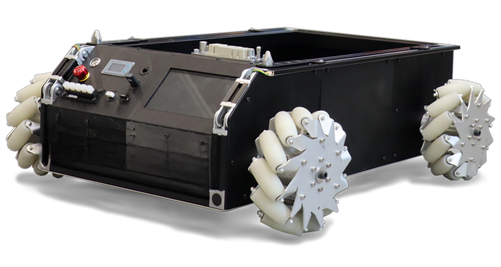
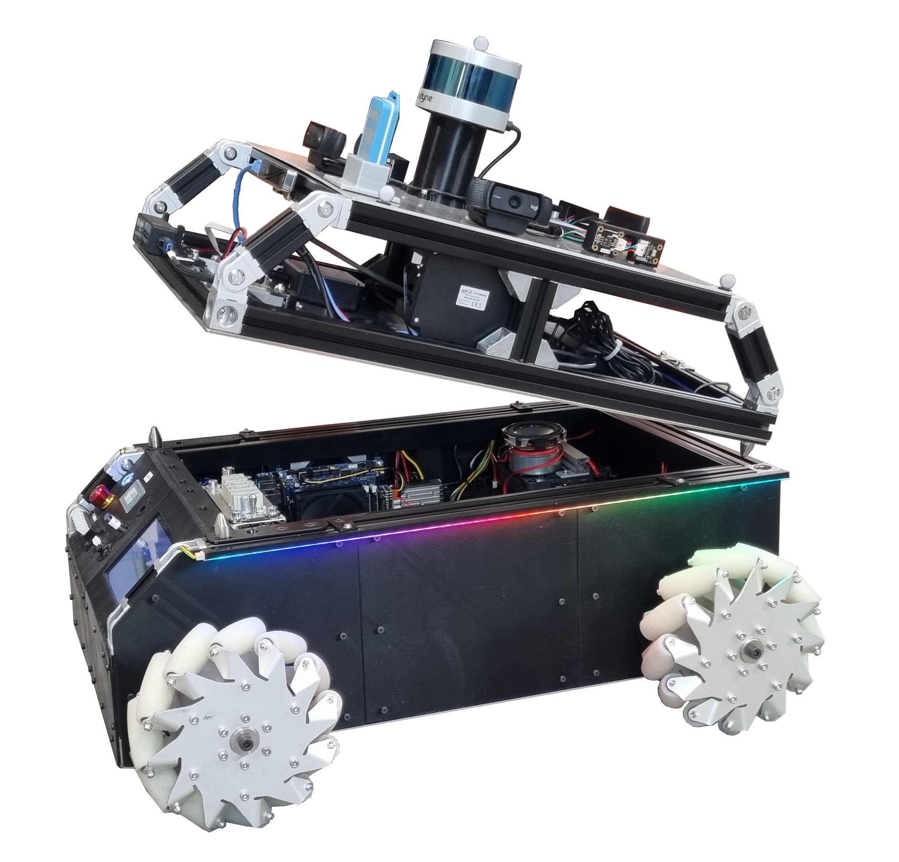
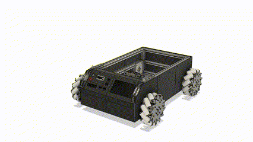
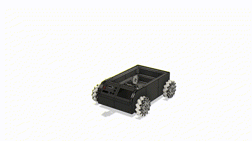
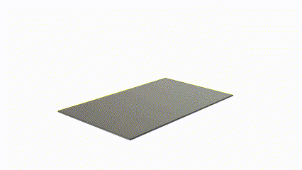

# Homepage

This is the official documentation of MoMo: An Open-Source Modular Mobile Robot Research Platform.  

 

MoMo is an innovative, open-source modular mobile robot designed for diverse research applications within indoor environments. Developed at the Institute of Technical Logistics at TUHH, Hamburg, Germany, MoMo empowers researchers to explore and innovate in fields such as localization, perception, manipulation and more.

## Key Features

- **Modularity**: Easily swap out top modules to shift between research applications like localization, perception, and manipulation.
- **Compatibility**: Fully compatible with ROS2 and ROS1, facilitating easy integration into existing projects.
- **Customizability**: Users can attach any sensor of their choice as a top module, allowing for a personalized research tool.

## Modular Concept

MoMo is designed with simplicity and accessibility in mind. It's easy to assemble using standard parts, and its open-source design allows for extensive customization and improvements. Different modules can be developed, such as a perception module equipped with lidar and cameras or a manipulation module featuring a robotic arm.

 

## Media Gallery

## Get Involved

MoMo is a community-driven project that thrives on your contributions! Here’s how you can get involved:

- **Build Your Own MoMo**: Follow our detailed documentation to build and customize your MoMo.
- **Contribute**: Enhance MoMo's capabilities by contributing to our [GitHub repository](https://github.com/TUHH-ITL/MoMo). Open pull requests or tackle existing issues.
- **Support and Queries**: If you encounter any issues or have suggestions, please [open an issue](https://github.com/TUHH-ITL/MoMo/issues) on our GitHub repository. For additional support or inquiries, you can also contact Markus at [markus.knitt@tuhh.de](mailto:markus.knitt@tuhh.de).

Join us in advancing the field of robotics through open-source collaboration and innovation!
